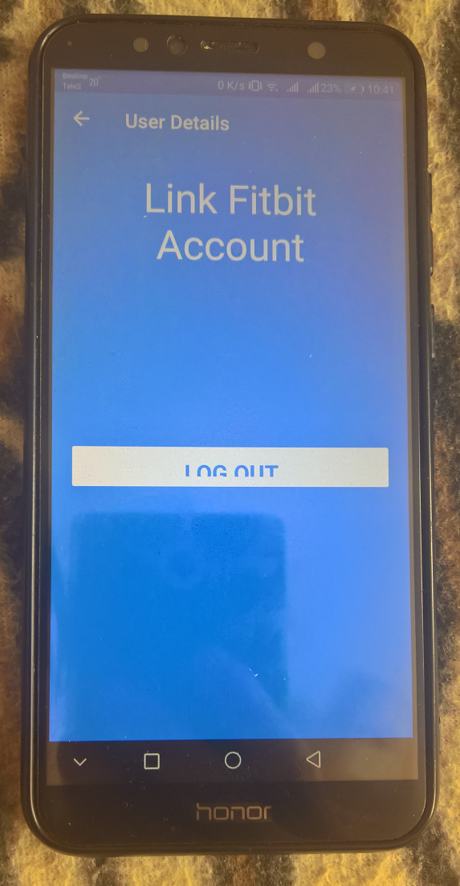

# FitBitWebAuthenticator

This is my fork of [FitBit_Xamarin_Forms](https://github.com/vipinjohney/FitBit_Xamarin_Forms) project.

## About 
Implementing Fitbit login and user api's in Xamarin Forms application.

## My 2 cents
- I noticed that the original version (FitBit_Xamarin_Forms) having only iOS and Android "targets". 
UWP "target" added/"injected" by me into FitBitWebAuthenticator solution ("fork"). 
- Min. os. win. switched to 16299. Note that no WinMobile compatibility realized at/by now! .NET Standard 2.0 used.

## Tech. details
You can find the steps by step explanation [here](https://medium.com/@vipin.johney/fitbit-authentication-xamarin-forms-5900ed8e9caa?source=friends_link&sk=bd8ec5376d3c6c32e02a4d1524679732).

## Credits 
[Vipin Johney](https://github.com/vipinjohney/) iOS Application Developer, wanderlust, technology enthusiast.

## ..
AS IS. No support. RnD only. DIY.

## .
[m][e] 2023